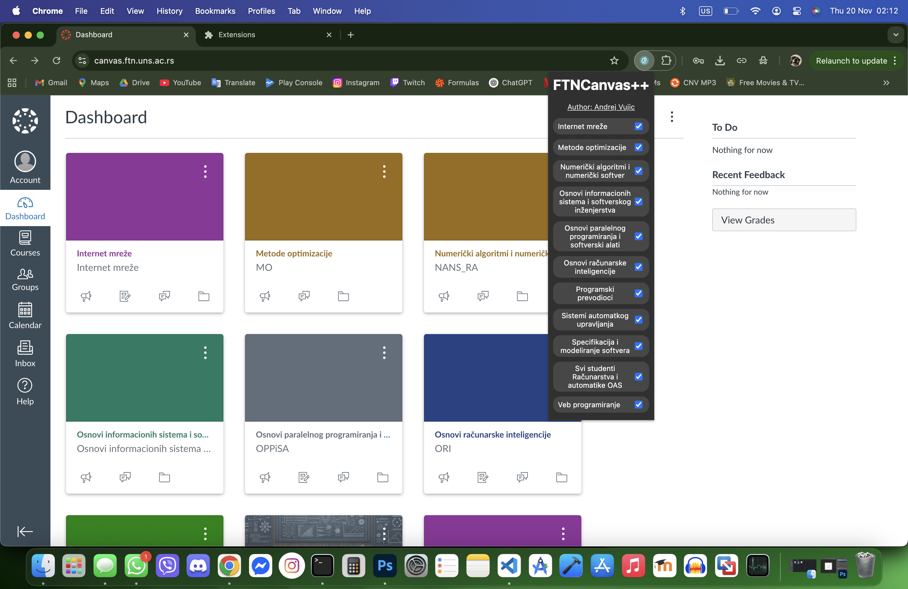

# O projektu

<b>FTN Canvas Plus Plus</b> je ekstenzija za Chrome koja omogućava sakrivanje kurseva na sajtu <a href="https://canvas.ftn.uns.ac.rs/">Canvas</a> za Fakultet tehničkih nauka u Novom Sadu. U popup meniju ekstenzije koja živi u alatnoj traci u Chrome-u je moguće odabrati kurseve čije kartice će biti prikazane.

# Motivacija

Na Canvasu-u se nerijetko prikazuju kartice za predemete koji su već položeni ili koji se slušaju tek u narednom semesturu - ovo zatrpava stranicu i otežava pristup kursevima koji su zapravo potrebni.

# Instalacija

1. Potrebno je preuzeti ovaj repozitorijum. Folder sačuvati na sigurnom mjestu - <b>brisanje foldera dovodi do toga da ekstenzija prestaje da radi</b>.

2. U Chrome-u otvoriti <code>chrome://extensions</code>.

3. U gornjem desnom uglu uključiti opciju <code>Developer mode</code>.

4. Nakon uključivanja opcije <code>Developer mode</code>, u gornjem lijevom uglu odabrati opciju <code>Load unpacked</code> i odabrati folder prethodno preuzeti folder.

Ekstenzija je spremna i nalazi se pored polja za pretragu (moguće je pronaći je klikom na ikonicu ). Ukoliko se kartice predmeta ne prikažu otvaranjem ekstenzije potrebno je osvježiti stranicu i pokušati ponovo.

